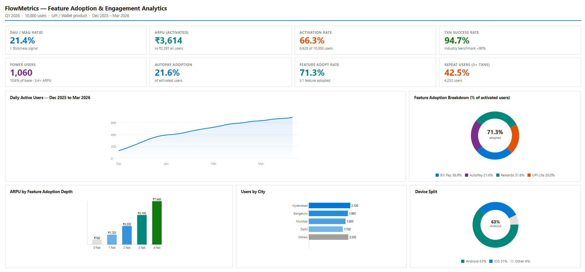
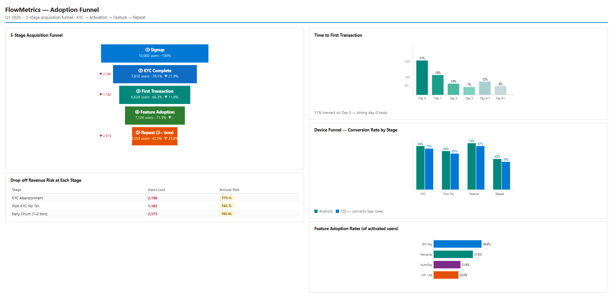
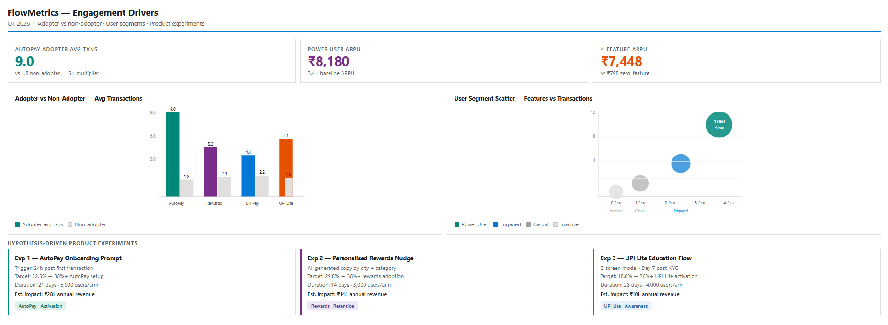

# Fintech Feature Adoption & Engagement Analytics

## 🚀 Project Overview
A comprehensive product analytics project analyzing feature adoption patterns in a UPI/wallet fintech product. Built with **Python**, **SQLite**, and **Power BI**.

**Key Insights:**
- 🔥 **AutoPay users drive 5× more transactions** (9.1 vs 1.8 avg)
- 💰 **₹79.1L revenue leak** at KYC abandonment stage
- 🚀 **Power users (10.6%) generate 3.4× average ARPU**
- 📈 **4-feature users spend ₹7,448 vs ₹798 for 0-feature**

---

## 📊 Dashboard Preview

### Page 1: Product Health Dashboard

*Executive summary with 8 KPIs, DAU trend, feature adoption, and ARPU analysis*

### Page 2: Adoption Funnel

*5-stage funnel with revenue risk, device comparison, and time-to-transaction*

### Page 3: Engagement Drivers

*Feature impact analysis, user segmentation, and 3 hypothesis-driven experiments*

---

## 🛠️ Tech Stack
| Tool | Purpose |
|------|---------|
| **Python** | Data generation & SQLite loading |
| **SQLite** | Database with 10 pre-built views |
| **Power BI** | Interactive dashboard |
| **GitHub** | Version control & documentation |

---

## 📈 Key Metrics
| Metric | Value |
|--------|-------|
| Total Users | 10,000 |
| Total Events | 51,586 |
| KYC Rate | 78.1% |
| Transaction Rate | 66.3% |
| AutoPay Adoption | 22.5% |
| AutoPay Multiplier | **5.1×** |
| Power Users | 878 (8.8%) |
| Power User ARPU | **3.4×** average |

---

## 💡 Business Recommendations
1. **AutoPay Onboarding Prompt** — Target: 22.5% → 30%+ (₹28L impact)
2. **Personalised Rewards Nudge** — Target: 29.8% → 38%+ (₹14L impact)
3. **UPI Lite Education Flow** — Target: 18.6% → 26%+ (₹10L impact)
